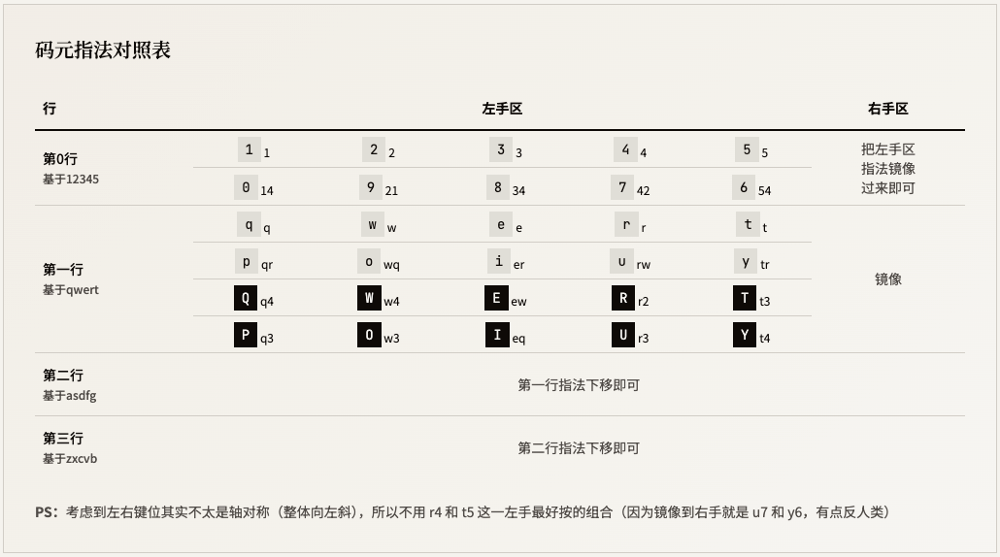
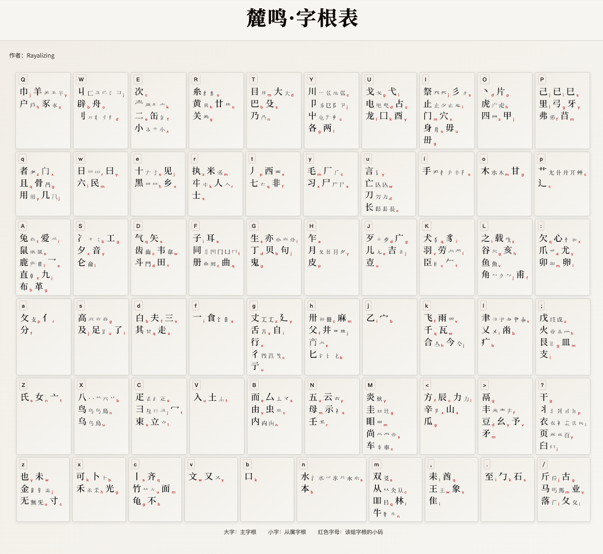

# 麓鸣输入法
> *呦呦鹿鸣，食野之苹。*

麓鸣——一款兼顾极简规则和极致性能的纯形顶功并击输入法。

一句话描述：纯形码、字词混打、三码定长、60 码元、双编码（大码乱序，小码音托）、支持 10w 汉字扩展字集、【6638 字全码零重码】、【一击顶功】的中文并击输入方案。

本项目包含麓鸣（YoYo）输入方案的 Rime 配置以及用于展示和练习字根的 HTML 可视化工具。

## 项目结构

```
yoyo-input/                         # 麓鸣输入法项目
 ├── README.md                      # 项目说明文档
 │
 ├── rime/                          # Rime输入方案配置目录
 │   ├── yoyo.yaml                  # 麓鸣码主配置文件
 │   ├── yoyo-bm.schema.yaml        # 北冥版配置
 │   ├── yoyo-bm.dict.yaml          # 北冥版词库
 │   ├── yoyo-wx.schema.yaml        # 无相版配置
 │   ├── yoyo-wx.dict.yaml          # 无相版词库
 │   ├── yoyo-practice.schema.yaml  # 练习版配置（用于结合练习工具练码元和字根）
 │   ├── yoyo-practice.dict.yaml    # 练习版词库
 │   ├── yoyo_kf.dict.yaml          # 快符词库（打符号用）
 │   ├── yoyo_char_kuozhan.dict.yaml # 扩展字库
 │   └── lua/yoyo/                  # Lua脚本目录
 │       ├── yoyo.lua               # 核心类定义
 │       ├── popping.lua            # 实现顶功逻辑
 │       └── commit_raw.lua         # 实现ctrl提交纯编码
 │
 ├── zigen_table/                   # 字根表生成和展示（生成HTML字根表页面）
 │   ├── mapping.yaml               # 字根与大码小码映射配置
 │   ├── yoyo-chai.yaml             # Chai字体配置
 │   ├── generate_html.py           # 生成HTML字根表页面
 │   ├── merge_mapping.py           # 合并字根映射
 │   ├── fix_with_substitute.py     # 字体替代修正
 │   ├── generate_char_images.py    # 生成字根图片
 │   ├── char_images/               # 字根图片目录（~500+png）
 │   ├── NotoSerifSC-Medium.otf    # 思源宋体（生成字根图片用）
 │   └── ChaiPUA-0.2.7.ttf         # Chai专用字体（生成字根图片用）
 │
 ├── practice_tool/                 # 字根练习工具
 │   ├── practice.html              # 练习页面主入口
 │   ├── style.css                  # 样式文件
 │   ├── base_practice.js           # 基础练习逻辑
 │   ├── memory_logic.js            # 记忆算法
 │   ├── state_manager.js           # 状态管理
 │   ├── ui_updater.js              # UI更新逻辑
 │   ├── input_handler.js           # 输入处理
 │   ├── utils.js                   # 工具函数
 │   ├── zigen_data_module.js       # 字根数据模块
 │   ├── generate_practice.py       # 生成练习数据
 │   ├── generate_zigen_data.py     # 生成字根数据
 │   └── mapping.yaml               # 字根映射配置
 │
 └── luming-input_full_website/     # 麓鸣介绍网站（结合了字根表和练习工具）

```

## 「麓（lù）鸣」的优势：

> *追求并击的上限。*

1. 极低击长（“击长”概念类比串击的“码长”）：

    - 单字最高码长为三码（分两击打出）；
    - 【一击】字（只需一次并击即可打出的字）加权占比为【94.3%】！
    - 一击顶功——继承并击独特的顶功优势，单字无需空格即可上屏。
2. 极低重码：

    - 单字前6638字【全码无重】！简码和全码都是零重码（6638字指GB2312和《通用规范汉字表》收录字符的交集）。
    - 前 60000 高频词，加权重码率只有【0.25%】！
    - 一击词和一击字打法不同，所以编码无重叠。
3. 思维负担低：

    - 相比其他并击方案，【指法更简单】。

      1. 按键更省力：单手最多同时按两个键来确定一个码元；
      2. 指法更固定：只需记住基于QWERT五个键的指法，通过平移和镜像的推理即可记住其它码位。
    - 相比其他形码，大字根，【拆分直观】。
    - 其本质是三码定长的形码方案，相比其他顶功方案，【打字规则简单】。
4. 独一无二的爽点：

    1. 100% 的确定感——单字零重，词重极低。
    2. 一键上屏字/词（30 个）

        只按一个键即可上屏（可能是单字，也可能是词），无需空格。

        同一键位如果同时安排了字和词，则按使用频率决定首选顺序；需要第二个候选时可用 `'` 选二选。

        ```
        一简字（30 个）：都是在人我要会有日用 你了的一很更与三就他 也和不这中吃对还上来
        一简词（30 个）：都是 时间 真的 数据 我们 非常 个人 有点 时候 用户 什么 就是 其他 一个 自己 很多 一些 其实 了解 使用 也是 可以 不错 这个 中国 味道 这样 还是 可能 未来
        单手一击字（120 个）：的是了在和我有不一就中人也很你都上会为这好到对大他要多还年说去来与能后被以更将小而看用吃让并日地从没新里给着家想点出或她之太本把比再前买那成所元月三性它发学车生店至加区张名部王子此每方则菜网心问线度李特重四动马原股花尔克五合感表建帮知男师群
        双手一击字（2032 个）
        综上，一击即出的字共 2152 个。
        ```

        - 对照：普通串击顶功，这样的一键字只有 5~8 个。
        - 此外，单手一击字共【120 个】，算上双手的一击字，共【2152 个】。

## 心法「形码基础」：如何打出一个字

如果你是第一次接触形码/并击，先记两句话就够用：

1. 汉字会被拆成若干「字根」，每个字根都有自己的编码。
2. 麓鸣打单字只取三个字根来编码：第一根、第二根、最后一根（所以单字最高三码）。

### 你需要知道的编码长相

- 每个字根是「双编码」：大码 + 小码
  - 大码：该字根所在的字母键位
  - 小码：该字根的第二个字母（多数可用“音托”规律联想，也可以当作纯字母记）

示例：字根「鹿」的编码是 `Al`，其中 `A` 是大码、`l` 是小码。

### 单字取码规则（只看这一段就能开始打）

为了让单字固定为三码，麓鸣按字根数量分三种情况：

- 单字根字：全码就是该字根的双编码
  - 例：`鹿 = Al`
- 双字根字：取第一根大码 + 第二根大码 + 第二根小码
  - 例：`鸣 = bXn`（口 `bk`，鸟 `Xn`）
- 多字根字：取第一根大码 + 第二根大码 + 最后一根大码
  - 例：`德 = ge:`（彳 `gc`，十 `es`，心 `:x`）

### 术语速查（看懂本文后面两套打法）

- 字根：把字按书写结构拆出来的部件。
- 码元：编码里允许出现的基本符号（一般为 a-z、数字、`;,./` 等符号）；并击可用组合键扩展码元集合（如加入 A-Z、`:<>?` 等）。
- 双编码：一个字根对应两位字母（大码 + 小码）。
- 简码：用更短的码直接打出的高频字/词（常见说法：一简、二简等）。
- 顶功 / 顶字上屏 / 顶屏：继续输入下一键时，候选框当前选中项会自动上屏。
- 并击：一次同时按下多个键，输出一个或多个码元。
- 串击：一次按一个键（或按键序列）逐个输入。

### 简码、顶功与选重（新手最常用）

字和词都设有一简、二简，词还有三简。

- 一简字示例：的 → `d`
- 一简词示例：什么 → `a`

一简/二简输入后，不需要空格确认：下一键会触发顶屏，默认上屏首选。

若候选不是首选，按 `'` 选二选并立即上屏（一简没有设三选）。

### 如何打出一个词（全码取码规则）

构成词的基本单位是单字。

词的全码是四码定长，可按下面规则从组成单字的编码中取出。

- 二字词：第一个字的前两码 + 第二个字的前两码
- 三字词：第一字首码 + 第二字首码 + 第三字前两码
- 四字词：第一二三四字的首码

> 对于「字根、双编码、简码（一简二简等）、顶屏（顶字上屏）」等概念的更多详细解释，感兴趣的可参考虎码（@PeaceB）[从这里开始](https://www.tiger-code.com/docs/tutorials#%E4%BB%80%E4%B9%88%E6%98%AF%E5%8F%8C%E7%BC%96%E7%A0%81%EF%BC%8C%E9%9F%B3%E6%89%98%E6%98%AF%E4%BB%80%E4%B9%88%EF%BC%9F)的教程，更详细见宇浩输入法（@朱宇浩）[这一部分](https://shurufa.app/docs/concepts.html#_4-4-%E5%AD%97%E6%A0%B9%E7%BC%96%E7%A0%81)的介绍。
>
> 对于顶功、并击等概念的详细解释，感兴趣可参考网站（@谭淞宸）：[顶功·集萃](https://ding.tansongchen.com/)!

## 指法「折梅」：平移&镜像

**指法更固定：** 每一行码元的指法都是一致的。只需记住基于 QWERT 五个键的指法，通过平移和镜像的推理即可记住其它码位。



## 字/词打法「两套功法」：充分发挥顶功特性

### **集合分组和定义：**

> 不同的按法会进入不同的“输入通道”，本文用 `A/a/B/b/C/c` 来区分它们。
>
> 记法约定：大写表示不按 `Space`，小写表示带 `Space`；`A/a` 是双手并击，`B/b` 是左手单手并击，`C/c` 是右手单手并击。
>
> 直观理解：双手并击一击输出两码，单手并击一击输出一码（是否带 `Space` 不改变码数，只改变通道/用途）。

不同的集合可以用来打出不同的对象。以「北冥」为例（后面会详细介绍）：

1. 双手并击为集合 `A`：打两码及以上的字
2. 单左手为 `B`：打一简字
3. 单右手为 `C`：打一简字
4. 单左手带 `Space` 并击为 `b`：打单字的第三码（左右结构 `⿰`，如“鸣”；或左下包围 `⿺`，如“爬、过”）
5. 单右手带 `Space` 并击为 `c`：打单字的第三码（除 `⿰`/`⿺` 之外的结构）
6. 双手带 `Space` 并击为 `a`：打词（四码定长，含一击简词）

 ——*通过增加结构筛选，单字最多只需三码，即可实现 6638 字集的全码无重。*

---

下面是两个功法的设计。

### 单字派 **——「北冥」：**

> *段誉所赠，逍遥派绝学。逍遥武功，以积蓄内力为第一要义；内力既厚，犹之北冥，天下武功无不为我所用*
>
> *打法：并击主单。为麓鸣完全体功法，专为打单的「爽点」打造。*

1. 打单：`A` 为第一击，一击若没出首选，则补一个 `b/c`，再之后的下一键触发顶屏上屏（`A` 一旦出现则会顶屏候选框中的内容）；

2. 打词：如果 `a` 作为第一击，则只会打词。词为四定（四码定长）模式：输入完四码后，开始输入下一键时触发顶屏上屏，词的第三、四码可以用 `b/c` 打出，也可以再用 `a` 一次性打出。
3. `B/C` 直出一简字/词，按下后会立即上屏（等价于触发一次顶屏）。

#### 例子：打单字（以“鸣”为例）

已知：`鸣 = bXn`，且“鸣”为左右结构 `⿰`（口 + 鸟），所以第三码走通道 `b`。

1. 第一击：用 `A` 输出前两码 `bX`。
2. 若候选首选已是“鸣”：继续输入下一键（例如下一个字/词的第一键），触发顶屏，“鸣”自动上屏。
3. 若首选不是“鸣”：用 `b` 补第三码 `n`（结构筛选 + 补码），再继续输入下一键触发顶屏，“鸣”上屏。

#### 例子：打词（以“动物园”为例）

已知：“动物园”的三简为 `NmU`，全码（四码）为 `NmUE`。

1. 第一击：用 `a` 输入前两码 `Nm`。
2. 第二击：用 `b或c` 输入第三码 `U`。
3. 若候选不是首选：按 `'` 选二选（如 `NmU'` 或 `NmUE'`），立即上屏。
4. 若需要精确到全码：继续用 `a` 输入后两码`UE`，再继续输入下一键触发顶屏，“动物园”上屏。

 *——通过第一击的打法不同，可将字词编码完全分离。*

### 主词派 **——「无相」：**

> *逍遥李秋水亲授。适配兼容，顺逆自如，不着形相，精微渊深。*
>
> *打法：并击主词，可随时连击。*
>
> - *并击连击可无缝转换：单手连击减少了思维压力，可作为双手并击的过渡；*
>
> - *对主词派来说，无相既是「过渡体」，也是「究极体」。*

1. 打词：`A` 为第一击，一击若没出首选，则可选补 `B` 或 `C`（一码一码地出）或 `A`（直出两码）；每输入满四码，下一键触发顶屏上屏。
2. 打单字：

    - 前两码：可选 `B` 或 `C` 连击，一码一码地出，左右手均可；或以 `a` 为第一击，直出前两码
    - 第三码：`b` 或 `c` 补第三码。`b` 打 `⿰`/`⿺` 结构的字，`c` 打其他结构的字。
3. 第一击为 `b/c` 直出一简字词

#### 例子：打单字（以“鸣”为例）

已知：`鸣 = KXn`，且“鸣”为左右结构 `⿰`，所以第三码走 `b`。

- 方案 1（单手连击）：`B` 出 `K` → `C` 出 `X` → `b` 出 `n` → 继续输入下一键触发顶屏，“鸣”上屏。
- 方案 2（双手起手）：`a` 先出前两码 `KX` → `b` 补 `n` → 继续输入下一键触发顶屏，“鸣”上屏。

#### 例子：打词（以“动物园”为例）

已知：“动物园”的三简为 `NmU`，全码（四码）为 `NmUE`。

1. 第一击：用 `A` 输入前两码 `Nm`。
2. 第二击：用 `b或c` 输入第三码 `U`。
3. 若候选首选已是“动物园”：继续输入下一键触发顶屏，“动物园”自动上屏。
4. 若候选不是首选：按 `'` 选二选（如 `NmU'` 或 `NmUE'`），立即上屏，或继续用 `b或c` 输入第四码 `E`。
5. 若需要精确到全码：可以用 `A` 输入后两码`UE`，再继续输入下一键触发顶屏，“动物园”上屏。

## 字根表

清晰版在[yoyo-字根表.pdf](rime/yoyo-字根表.pdf)，或浏览器打开[这个html](zigen_table/zigen_table.html)（点击各字根可查看详细解释）


## 如何使用
进入[Rime官网](https://rime.im/)下载rime输入法 → 在用户目录下复制粘贴[rime文件夹](rime/)中的所有内容 → 重新部署即可使用。

## 字根练习工具

将本仓库克隆到本地 → 进入[practice_tool](practice_tool/)目录 → 用浏览器打开[practice.html](practice_tool/practice.html) → 按照提示操作，即可练习字根

## 网站部署和查看
[luming-input_full_website](luming-input_full_website/)是该输入法的介绍网站，用于展示麓鸣输入法的相关内容。
其docs目录下的[README](luming-input_full_website/docs/README_How_to_deploy.md)包含了网站部署的详细方法。

## 致谢
本方案产生自：[汉字自动拆分系统](https://chaifen.app/)

思路和字根参考：
  - [顶功·集萃](https://ding.tansongchen.com/)
  - [虎码](https://www.tiger-code.com/)
  - 汉字自动拆分系统开发群（群号627379895）
  - 并击交流群 - 并击並擊（群号374971723）